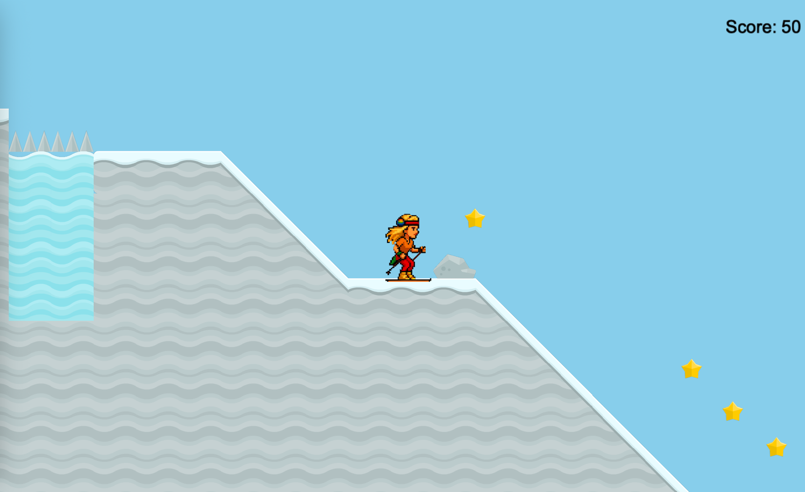

# 🎿 Ski Shakira

Welcome to **Ski Shakira** - an exciting 2D platformer game developed as a team project at the Studienkolleg. In this game you control a skier through snowy levels full of challenges, light and shadow effects and collect as many points as possible through acrobatic stunts.

---

## 🕹️ Game description

**Ski Shakira** is a level-based platformer game with two different maps:

* **Level 1:** Introduction to controls and gameplay. Easy obstacles and good visibility.
** **Level 2:** Darker level with limited visibility and more challenging obstacles.

The aim of the game is to overcome obstacles, collect coins and reach the goal as quickly as possible without being damaged.

---

## 🎮 Controls

* **Left/right arrow keys:** Rotate
* **Space bar:** Jump
* **R:** Restart level
* **N:** Go to next level


---

## 🖼️ Screenshot



---

## 🛠️ Installation

### Requirements

* Python **3.10+**
* Arcade **3.1+**
* Pymunk

### Steps

1. Download repository:

```bash
git clone https://git.tu-berlin.de/mittagspuase/platformer.git
cd platformer
```

2. Set up virtual environment (optional but recommended):

```bash
python -m venv venv
source venv/bin/activate  # for macOS/Linux
venv\Scripts\activate  # for Windows
```

3. Install dependencies:

```bash
pip install -r requirements.txt
```

4. Start the game:

```bash
python Ski_Shakira_main.py
```

---

## 📘 Project overview

* Developed as part of the software project at Studienkolleg Berlin
* Task: Implementation of a platformer game with Python and the Arcade library

---

## 👥 Team

* **Abdulloh Khakimov (@akhakiym)** – Git, level design
* **Elizaveta Chichkanov (@chiliza)** – Game design
* **Koustav Agrawal (@koustavagr2005)** – Main programming
* **Aanjneya Moudgil (@aanjneya)** – Testing and error management
* **Juanita Giraldo Foronda (@juanisg)** – Graphic Design

> Although everyone had a specific role, the team supported each other in the development of all components.


## 📄 Further information about the project
- Our [Game Design](docs/game-design.md) with story, concept, mechanics, game character.
- [Level Design](docs/level-design.md): Tilesets, maps, design
- [Programming](docs/implementation.md): Everything about the Python source code
- And [how we use git](docs/git.md)!
- [Project management documentation](docs/project-management.md).
- [Testing and debugging](docs/test.md)
- Overview of the [AI tools](docs/ai.md) used
- Tabular overview of [external sources](docs/references.md)
