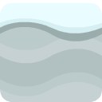
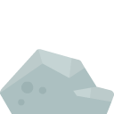

# Level Design Dokumentation

Level Design hat gemacht: Abdulloh Khakimov

---

## Levelkonzept

Unser Spiel besteht aus **zwei Leveln**:

- **Level 1** ist ein Einführungslevel, in dem der Spieler die Steuerung und Spielmechaniken lernt. Die Karte ist relativ einfach, mit ein paar Hindernissen und gut sichtbaren Elementen.
- **Level 2** ist deutlich schwieriger: Die Karte ist größer, beinhaltet mehr Hindernisse und ist durch Dunkelheit visuell eingeschränkt – die Sicht ist nur durch einen Lichtkegel möglich.

Der Übergang erfolgt durch Tastendruck:
- Nach Abschluss von Level 1: Taste **N** → Start von Level 2.
- Nach Abschluss von Level 2 endet das Spiel mit einer Siegesanimation und Anzeige des Punktestands.

Die beiden Level unterscheiden sich nicht nur im **Namen**, sondern auch in ihrer **Kartenstruktur** und den verwendeten **Tilesets**.

---

## Spielmechaniken im Level Design

Unsere Level-Mechaniken basieren auf realistischen physikalischen Prinzipien:

- Der Spieler erkennt klar den Unterschied zwischen Schnee, Münzen, Steinen und Wasser.
- Die Spielfigur bewegt sich auf **welligem Untergrund**, passt sich dabei dem **Neigungswinkel** an und rotiert entsprechend.
- Die Sprungmechanik sorgt für **weiches Springen und realistisches Landen**.
- Kollisionen mit Hindernissen (z. B. Stein oder Wasser) führen zum Spielende.
- Münzen können durch Berührung eingesammelt werden.
- Der Spieler kann **Kunststücke (Saltos)** mit den Pfeiltasten ausführen – bei riskanter Landung (mit dem Kopf zuerst) endet das Spiel ebenfalls.

Die Physikmechanik wurde mithilfe der **Pymunk-Bibliothek** implementiert und ist in beiden Leveln identisch aktiv.

---

## Karten und Tilesets

Zur Erstellung der Karten und Tilesets nutzten wir:

- **Piskel** für eigene Tilesets (z. B. Schnee und Stein)
- **Tiled Map Editor** zur visuellen Kartenerstellung
- Exportformate: `.tmj` (Tiled JSON) und `.tmx` (Tilemap XML für Tileset-Sammlungen)

Für die beiden Level verwendeten wir unterschiedliche Ressourcen:

- **Level 1:** Default-Tilesets aus der Arcade-Bibliothek
- **Level 2:** Eigene Tilesets, erstellt mit Piskel

Beispiele von Tileset:

**Schnee:**  


**Stein:**  


Die Größe der einzelnen Tiles beträgt **128x128 Pixel**.

---

## Technische Realisierung

Die Karten wurden in Arcade wie folgt eingebunden:

```python
map_path = os.path.join(os.path.dirname(os.path.abspath(__file__)), f"map/Level{level_number}.tmj")
self.tile_map = arcade.load_tilemap(
    map_path, layer_options=layer_options, scaling=TILE_SCALING
)
```

### Layerstruktur:

- **Terrain**: Boden (z. B. Schnee)
- **Obstacles**: Hindernisse (z. B. Stein, Wasser)
- **Collectibles**: Münzen

### Herausforderung:

Das einzige Problem war die **Pfadangabe**, da Teammitglieder mit verschiedenen Betriebssystemen arbeiteten. Dies wurde durch den Einsatz der **`os`-Bibliothek** gelöst.

---

## Balancing

### Schwierigkeitsgrad

Der Schwierigkeitsgrad hängt ab von:

- Kartengröße
- Anzahl und Platzierung der Hindernisse
- Sichtverhältnissen (Level 2 ist dunkel)

### Testmethoden

Nach jedem Leveldesign wurde die Karte ins Repository hochgeladen und von jedem Teammitglied getestet. Basierend auf Feedback wurden Karten verbessert und optimiert.

### Anpassungen

Jeder Testdurchlauf führte zu sinnvollen Verbesserungen in Bezug auf Layout, Hindernisplatzierung und Spielbarkeit.


### Bewertung

- **Level 1** ist am besten balanciert – mit ebenem Terrain und klarer Struktur.
- **Level 2** enthält unebenes Terrain, das ursprünglich komplexer gestaltet werden sollte, aber durch Einschränkungen der Arcade-Bibliothek begrenzt war.

